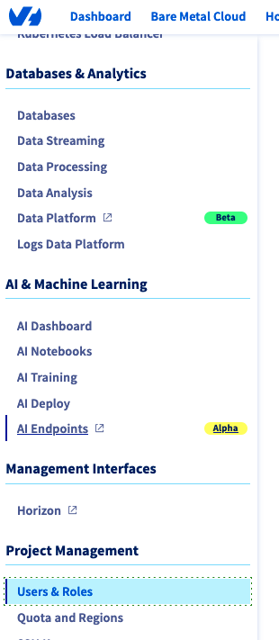
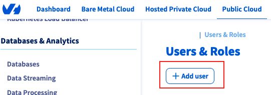
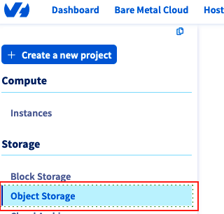
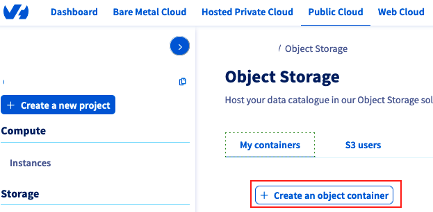
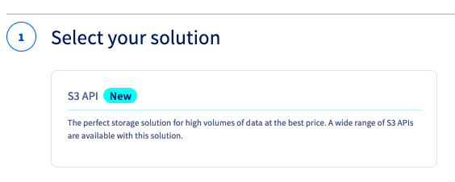
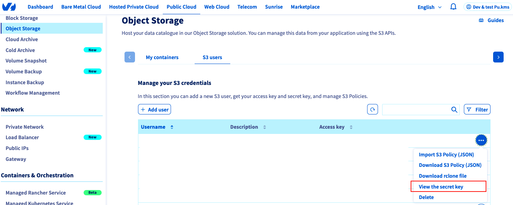

# edc-ovhcloud-s3 - Example of a OVHcloud S3 launcher connector

## Introduction

The project is a simple example of a provider and consumer
[EDC](https://github.com/eclipse-edc/Connector) connector that can be used to
demonstrate the capabilities of the EDC's extension to support OVHcloud S3.

The provider connector is able to read data from a OVHcloud S3 bucket,
while the consumer connector is able to write data to another OVHcloud S3 bucket.

## Prerequisites

To build and run the project, you will need the following:

- Java JDK 17 or later
- Kotlin 1.5 or later
- Gradle 7.0 or later
- Docker
- OVHcloud S3 users and buckets
- Bash shell

### OVHcloud S3 configuration

#### I. Source bucket

1. Sign in into the OVHcloud console (aka Manager)

2. In the navigation bar on the top of the page, select **Public Cloud**
   
3. In the left navigation pane, select an existing project or choose **Create a new project**. This is the project the S3 buckets will belong to.
   
4. In the left navigation pane, under the **Project Management** section, select **Users & roles**
   
5. Choose **Add user**
   
6. Enter a user description, then choose **Next**
7. Choose **ObjectStore operator** then choose **Validate**
8. In the left navigation pane, under the **Storage** section, select **Object Storage**
   
9. In the **My containers** tab, select **Create an object container**
   
10. Choose **S3 API**
    
11. Choose a region
12. Link the user created in the previous step
13. (Recommended) Choose **"Server-side encryption with OVHcloud Managed Keys (SSE-S3)"**
14. Enter the bucket name, then **Create the container**
15. Once the bucket is created, click on the bucket on the list, and note its endpoint
16. In the **S3 users** tab, look for the linked user, note his **Access Key** value, then choose **View the secret key**
    

#### II. Sink (Destination) bucket

Repeat the above process.

#### III. Security considerations

Follow the guide here: https://help.ovhcloud.com/csm/en-public-cloud-storage-s3-identity-access-management?id=kb_article_view&sysparm_article=KB0047362

## Launcher configuration

The project uses properties files for configuration. These are located in the `development/resources/` directory.
There are two main configuration files:

- `provider-config.properties`: This file contains configuration for the provider's connector.
- `consumer-config.properties`: This file contains configuration for the consumer's connector.

The configuration files contain the following properties:

| Property                   | Description                                 |
| -------------------------- | ------------------------------------------- |
| edc.hostname               | The name of the connector's host            |
| edc.participant.id         | ID of the participant                       |
| web.http.port              | Port for connector api                      |
| web.http.path              | Path for connector api                      |
| web.http.control.port      | Port for connector control plane api        |
| web.http.control.path      | Path for connector control plane api        |
| web.http.public.port       | Port for connector public api               |
| web.http.public.path       | Path for connector public api               |
| web.http.protocol.port     | Port for connector dataspace protocol api   |
| web.http.protocol.path     | Path for connector dataspace protocol api   |
| edc.dsp.callback.address   | Address for dataspace protocol api callback |
| edc.api.auth.key           | API Key to protect apis                     |
| edc.vault.clientid         | client ID for vault                         |
| edc.vault.tenantid         | Tenant ID for vault                         |
| edc.vault.certificate      | Path where certificates can be found        |
| edc.vault.name             | Name of vault                               |
| edc.ovhcloud.s3.access.key | Access Key to access to OVHcloud s3 bucket  |
| edc.ovhcloud.s3.secret.key | Secret Key to access to OVHcloud s3 bucket  |
| edc.ovhcloud.s3.endpoint   | URL to access to OVHcloud s3                |

## Building

To build the project, run the following command in development directory:

```bash
./gradlew assemble
```

This will compile the code and create a JAR file in the `build/libs` directory.

## Running

### Provider

To run the provider connector from development directory:

```bash
java -jar build/libs/dataspace-connector.jar -Dedc.fs.config=./resources/provider-config.properties
```

check the logs to see if the connector is running.

### Consumer

To run the consumer connector from development directory:

```bash
java -jar build/libs/dataspace-connector.jar -Dedc.fs.config=./resources/consumer-config.properties
```

check the logs to see if the connector is running.

## Scenario

> Note: In the following scenario, we will use the file `device1-data.csv`
> that was uploaded to the provider bucket.
>
> The provider connector is configured with the following endpoints:
>
> - web.http.port=19191
> - web.http.path=/api
> - web.http.control.port=19192
> - web.http.control.path=/control
> - web.http.management.port=19193
> - web.http.management.path=/management
> - web.http.protocol.port=19194
> - web.http.protocol.path=/protocol
> - edc.dsp.callback.address=http://localhost:19194/protocol
> - web.http.public.port=19291
> - web.http.public.path=/public
> - edc.dataplane.api.public.baseurl=http://localhost:19291/public
>
> The consumer connector is configured with the following endpoints:
>
> - web.http.port=29191
> - web.http.path=/api
> - web.http.control.port=29192
> - web.http.control.path=/control
> - web.http.management.port=29193
> - web.http.management.path=/management
> - web.http.protocol.port=29194
> - web.http.protocol.path=/protocol
> - edc.dsp.callback.address=http://localhost:29194/protocol
> - web.http.public.port=29291
> - web.http.public.path=/public
> - edc.dataplane.api.public.baseurl=http://localhost:29291/public

### 01 - Create an Asset on the provider side

The following request creates an asset on the provider connector.

```bash
curl -X "POST" "http://localhost:19193/management/v3/assets" \
     -H 'Content-Type: application/json' \
     -d $'{
  "properties": {
    "name": "List of data captured by sensors",
    "contenttype": "text/csv"
  },
  "@context": {
    "@vocab": "https://w3id.org/edc/v0.0.1/ns/"
  },
  "dataAddress": {
    "type": "OVHCloudS3",
    "bucketName": "datatset01",
    "objectName": "device1-data.csv"
  },
  "@id": "asset-01"
}'
```

### 02- Create a Policy on the provider side

The following request creates a policy on the provider connector.
This policy allows any consumer to download any asset without restrictions.

```bash
curl -X "POST" "http://localhost:19193/management/v2/policydefinitions" \
     -H 'Content-Type: application/json' \
     -d $'{
  "@context": {
    "odrl": "http://www.w3.org/ns/odrl/2/",
    "@vocab": "https://w3id.org/edc/v0.0.1/ns/"
  },
  "@id": "policy-01",
  "policy": {
    "extensibleProperties": {
      "downloadable": "true"
    },
    "obligation": [],
    "@context": "http://www.w3.org/ns/odrl.jsonld",
    "permission": [],
    "@type": "Set",
    "prohibition": []
  }
}'
```

## 03- Create a contract definition on Provider side

Add a contract definition that associates policies to our asset identified by its id.

```bash
curl -X "POST" "http://localhost:19193/management/v2/contractdefinitions" \
     -H 'Content-Type: application/json' \
     -d $'{
  "accessPolicyId": "policy-01",
  "@context": {
    "edc": "https://w3id.org/edc/v0.0.1/ns/"
  },
  "contractPolicyId": "policy-01",
  "assetsSelector": [
    {
      "operandLeft": "https://w3id.org/edc/v0.0.1/ns/id",
      "operator": "=",
      "operandRight": "asset-01"
    }
  ],
  "@id": "contract-01"
}'
```

## 04- Fetch catalog on consumer side

Now, we can request consumer connector to fetch the catalog from the provider connector.
Consumer connector gets assets and associated contract definition if policies allow.

```bash
curl -X "POST" "http://localhost:29193/management/v2/catalog/request" \
     -H 'Content-Type: application/json' \
     -d $'{
  "@context": {
    "@vocab": "https://w3id.org/edc/v0.0.1/ns/"
  },
  "counterPartyAddress": "http://localhost:19194/protocol",
  "protocol": "dataspace-protocol-http"
}'
```

## 05- Initiate a contract negotiation from consumer to provider

To download the asset, the consumer connector needs to initiate a contract negotiation with the
provider connector.

> Note: The `counterPartyAddress` should be the provider connector's protocol endpoint.
> The policy `@id` should be the policy id returned by provider connector in step 02.

```bash
curl -X "POST" "http://localhost:29193/management/v2/contractnegotiations" \
     -H 'Content-Type: application/json' \
     -d $'{
  "counterPartyAddress": "http://localhost:19194/protocol",
  "policy": {
    "target": "asset-01",
    "assigner": "provider",
    "@context": "http://www.w3.org/ns/odrl.jsonld",
    "@type": "Offer",
    "@id": "<policy-ID>"
  },
  "@context": {
    "odrl": "http://www.w3.org/ns/odrl/2/",
    "@vocab": "https://w3id.org/edc/v0.0.1/ns/"
  },
  "connectorId": "provider",
  "@type": "NegotiationInitiateRequestDto",
  "protocol": "dataspace-protocol-http"
}'
```

Thanks to this request, the provider connector will receive a contract negotiation request and
check if the policy allows the consumer to download the asset.

## 06- Getting the negotiation status

Negotiation process can take some time.
You can check the status of the negotiation by using the following request.

> Note: Replace `<negotiation id>` with the negotiation id returned by the previous request.
> Replace `<policy id>` with the policy id returned by the provider connector in step 02.

```bash
curl "http://localhost:29193/management/v2/contractnegotiations/<negotiation id>" \
     -H 'Content-Type: application/json' \
     -d $'{
  "counterPartyAddress": "http://localhost:19194/protocol",
  "@context": {
    "@vocab": "https://w3id.org/edc/v0.0.1/ns/"
  },
  "protocol": "dataspace-protocol-http",
  "@type": "ContractRequest",
  "policy": {
    "target": "assetId",
    "assigner": "provider",
    "@context": "http://www.w3.org/ns/odrl.jsonld",
    "@type": "Offer",
    "@id": "<policy id>"
  }
}'
```

## 07- Initiate a Transfer from consumer to provider

If contract negotiation is successful, the consumer connector can initiate a transfer process to download the asset.

```bash
curl -X "POST" "http://localhost:29193/management/v2/transferprocesses" \
     -H 'Content-Type: application/json' \
     -d $'{
  "assetId": "asset-01",
  "protocol": "dataspace-protocol-http",
  "counterPartyAddress": "http://localhost:19194/protocol",
  "@type": "TransferRequestDto",
  "connectorId": "consumer",
  "dataDestination": {
    "type": "OVHCloudS3",
    "bucketName": "<consumer bucket>",
    "objectName": "<name of file>"
  },
  "contractId": "<contract id>",
  "@context": {
    "@vocab": "https://w3id.org/edc/v0.0.1/ns/"
  }
}'
```

> Note: Replace `<negotiation id>` with the negotiation id returned by the previous request.
> Replace `<policy id>` with the policy id returned by the provider connector in step 02.
> Replace `<consumer bucket>` with the consumer bucket name.
> Replace `<name of file>` with the name of the file if you want to rename it.

## 08- Check Transfer Status

You can check the status of the transfer process by using the following request.

> Note: Replace `<transfer id>` with the transfer id returned by the previous request.
> Replace `<policy id>` with the policy id returned by the provider connector in step 02.
> Replace `<consumer bucket>` with the consumer bucket name.
> Replace `<name of file>` with the name of the file if you want to rename it.

```bash
curl "http://localhost:29193/management/v2/transferprocesses/<transfer id>" \
     -H 'Content-Type: application/json' \
     -d $'{
  "assetId": "asset-01",
  "protocol": "dataspace-protocol-http",
  "counterPartyAddress": "http://localhost:19194/protocol",
  "@type": "TransferRequestDto",
  "connectorId": "consumer",
  "dataDestination": {
    "type": "OVHCloudS3",
    "bucketName": "<consumer bucket>",
    "objectName": "<name of file>"
  },
  "contractId": "<contract id>",
  "@context": {
    "@vocab": "https://w3id.org/edc/v0.0.1/ns/"
  }
}'
```
